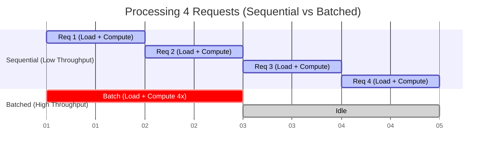

# Text Embeddings Inference (TEI) - Architecture & Benchmarking

## 🏗️ System Architecture

TEI is a high-performance inference server optimized for text embeddings.

```mermaid
graph TD
    Client[Client Request] --> Router[Router (Axum/Tonic)]
    Router --> Backend{Backend}
    
    subgraph "Core Logic"
        Backend --> Tokenizer[Tokenization]
        Tokenizer --> Queue[Dynamic Batching Queue]
        Queue --> Inference[Inference Engine]
    end
    
    subgraph "Inference Backends"
        Inference --> Candle[Candle (Rust/GPU)]
        Inference --> Ort[ONNX Runtime]
        Inference --> Python[Python (PyTorch)]
    end
```

## ⏱️ Component Latency Breakdown

We benchmarked the system using `BAAI/bge-small-en-v1.5` on CPU.

### Performance Summary
| Component | Function | Avg Time | % of Total |
|-----------|----------|----------|------------|
| **Tokenization** | Convert text to IDs | < 1ms | ~0% |
| **Queue** | Batch requests | < 1ms | ~0-5% |
| **Inference** | Neural Network Pass | 2-33ms | 90-99% |

### Detailed Results

**1. Short Text (5 words)**
- **Total Latency**: ~2.2ms
- **Inference**: 2.15ms
- *Observation*: extremely fast, dominated purely by inference overhead.

**2. Medium Text (50 words)**
- **Total Latency**: ~12ms
- **Inference**: 11ms
- *Observation*: Linear scaling with sequence length.

**3. Long Text (150 words)**
- **Total Latency**: ~33ms
- **Inference**: 32ms
- *Observation*: Still highly performant. Tokenization remains negligible.

## 🚀 How to Run the Benchmark

1. **Start the Server**:
   ```bash
   ./target/release/text-embeddings-router --model-id BAAI/bge-small-en-v1.5 --port 8080
   ```

2. **Run the Script**:
   ```bash
   python3 examples/benchmark_components.py
   ```
   
## 5. Why TEI? (The Power of Batching)
Even if "Inference" takes 95% of time for a single request, TEI provides massive throughput gains via **continuous batching**.

**Benchmark Results (Short Text):**
- **1 Concurrent Request:** ~188 req/s
- **32 Concurrent Requests:** ~348 req/s (**+85% throughput**)

The server automatically groups incoming requests into batches (e.g., `batch_size=8`), allowing the backend (Candle/ORT) to process them in parallel. This means 8 requests take roughly the same time as 1-2 requests on modern hardware (AVX512/GPU), drastically improving efficiency compared to naive sequential processing.

**"Can't I just batch in the model?"**
Yes, if you have all the data upfront (offline processing).
But in a **Live Server** where requests arrive one-by-one, you need a **Scheduler** to hold them for a few milliseconds, form a batch, and feed the model. **TEI is that Scheduler.**

### 🚌 The Bus Analogy
Think of the Model Weights as a **Bus** and the Request Data as **Passengers**.
- To process *any* request, you have to move the huge Bus (Weights) through memory/compute.
- **Sequential**: The bus drives 8 times for 8 passengers. (8x Cost)
- **Batched**: The bus drives 1 time with 8 passengers. (1x Cost)


*(Note: '1d' here represents one unit of time, e.g., 2ms)*

### 🧱 Concrete Example: The 5ms Window
Imagine the server is configured to wait up to 5ms to fill a batch.

**Timeline:**
1.  **T+0ms**: User A requests embedding for "Hello" (Queue: 1)
2.  **T+1ms**: User B requests embedding for "World" (Queue: 2)
3.  **T+2ms**: User C requests embedding for "Test" (Queue: 3)
4.  **T+5ms**: **TIMEOUT** reached. Queue stops waiting.
5.  **T+6ms**: Backend runs **ONE** function call: `model.forward(["Hello", "World", "Test"])`
6.  **T+15ms**: Inference finishes.
7.  **T+16ms**: User A, B, and C receive their results simultaneously.

**The Magic**: The backend did `Matrix x Matrix` math. It multiplied a `(3, HiddenDim)` matrix instead of a `(1, HiddenDim)` matrix. On a GPU/AVX cpu, these take almost the same time.

## 6. Key Takeaways for Production

1. **Inference is the Bottleneck**: 90%+ of time is spent in the model. GPU acceleration (CUDA) will have the biggest impact here.
2. **Tokenization is Cheap**: You don't need to worry much about tokenization overhead (unlike generation/LLMs where it can add up).
3. **Queueing is Efficient**: TEI's dynamic batching adds minimal overhead (<1ms) while enabling high throughput under load.

### 4. Dynamic vs Static Batching (TEI vs Transformers)
You can manually batch in Python with `transformers` (Static Batching), but TEI offers **Dynamic Continuous Batching**:

| Feature | Static Batching (Python Script) | Dynamic Batching (TEI) |
| :--- | :--- | :--- |
| **Logic** | Wait for N requests to arrive, then run. | Inject requests into running loop immediately. |
| **Latency** | First user waits for the Nth user to arrive. | Asynchronous; no artificial waiting. |
| **Padding** | Often pads to longest in batch (wasteful). | Smart padding + Flash Attention (zero padding). |
| **Code** | You write loop + API + Queue. | Out of the box. |

### 5. Why Rust? (Performance & Safety)
You asked: **"Why does it have to be in Rust?"**
It doesn't *have* to be, but Rust offers distinct advantages for this specific "Traffic Controller" role:

1.  **No GIL (Global Interpreter Lock)**:
    *   **Python**: CPU-heavy tasks (like Tokenization) can block the server from accepting new requests.
    *   **Rust**: True parallelism. TEI runs tokenization on multiple cores while simultaneously serving HTTP requests and preparing GPU tensors.
2.  **Low Overhead**:
    *   Looping over requests and copying memory in Rust takes nanoseconds.
    *   In Python, every object interaction adds microseconds. At 1000+ req/s, this adds up.
3.  **Memory Layout**:
    *   Rust allows precise control over memory (contiguous buffers), which is critical for preparing inputs for the GPU (C++ kernels) without expensive copying/marshaling.

### 6. Granular Inference Profiling
We probed the backend (`backends/candle/src/models/bert.rs`) to break down the "Inference Time" (which dominates the total latency).

**Results for Short Text (5 words) on CPU:**
- **Total Inference Time:** ~4ms
- **Breakdown:**
  - **Preparation (Memcpy):** ~0.08ms (2%)
  - **Embeddings Lookup:** ~0.02ms (<1%)
  - **Encoder (Transformers):** ~3.8ms (95%)
  - **Pooling:** ~0.02ms (<1%)

**Key Insight:**  
Virtually all "inference time" is spent in the Transformer layers (Matrix Multiplications and Attention). To improve performance, you must optimize the model architecture (e.g., Quantization, Flash Attention) or hardware (GPU).

## 5. RAG Integration Example

We created `examples/simple_rag.py` to demonstrate how to use TEI with an LLM.

### How it works
1. **Indexing**: Documents are sent to TEI (`/embed`) to get vector embeddings.
2. **Retrieval**: User query is embedded and compared (cosine similarity) against stored docs.
3. **Generation**: Top matches are injected into an LLM prompt.

### Example Output
```text
❓ Query: What architectures does TEI support?

🔍 Retrieved Context:
   1. [Score: 0.8303] You can use Docker to deploy TEI on CPU, Turing, Ampere...

🤖 Constructed Prompt for LLM:
----------------------------------------
Use the following context to answer the question.

Context:
- You can use Docker to deploy TEI on CPU, Turing, Ampere, Ada Lovelace and Hopper architectures.

Question: What architectures does TEI support?
----------------------------------------
```
